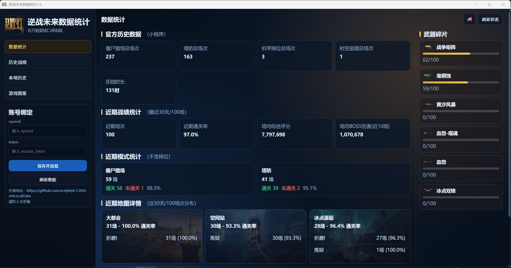
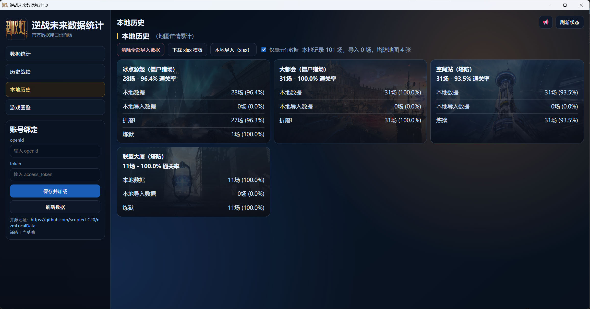
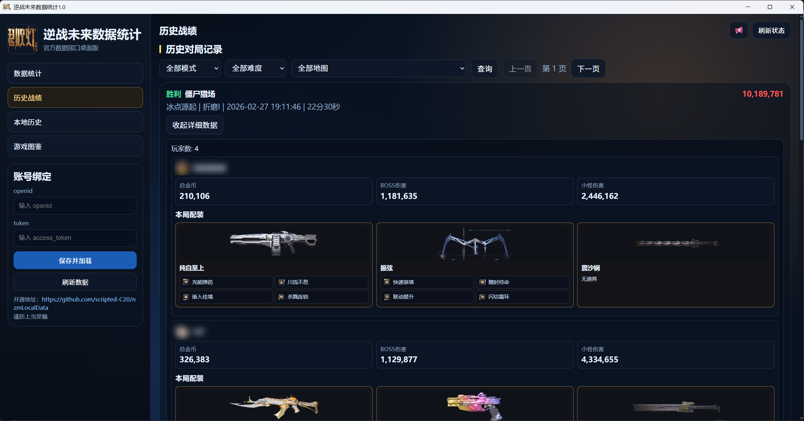
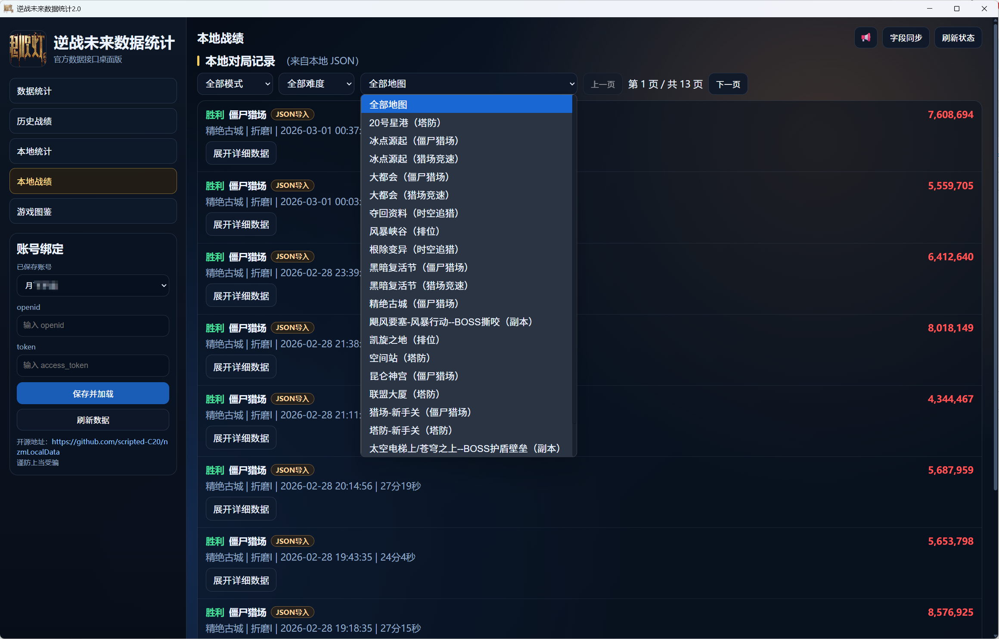
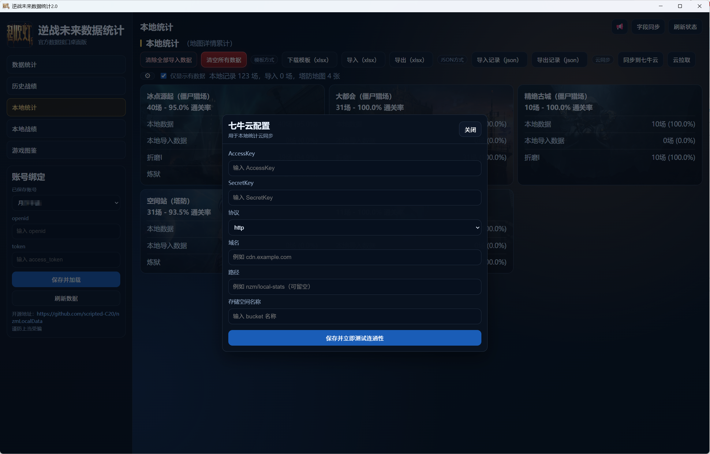

# 逆战未来数据统计（Electron）

基于官方接口的桌面客户端，提供数据统计、历史战绩、图鉴、本地统计、本地战绩、公告通知与云同步能力。

谨防上当受骗。

## 功能概览 （2026-03-01）

- 账号绑定（多账号）
  - 使用 `openid + access_token` 绑定。
  - 账号信息保存在 `data/account-binding.json`。
  - 支持账号切换与本地数据按 `uin` 分文件保存。

- 数据统计
  - 官方历史数据卡片。
  - 近期战绩统计、近期模式统计、近期地图详情。
  - 武器碎片进度展示。

- 历史战绩
  - 分页展示（每页 10 条）。
  - 模式、地图等筛选。
  - 支持展开单局详情（含 roomID 详情接口）。

- 本地统计
  - 本地聚合统计（地图/难度/场次/通过率）。
  - 支持模板导入（Excel）与无模板 JSON 导入。
  - 支持分批导入、分批清理、清空全部导入数据、清空所有数据。
  - 支持“仅显示有数据”开关。

- 本地战绩
  - 从本地 JSON 展示战绩列表。
  - 支持自动筛选。

- 图鉴
  - 武器/陷阱图鉴展示与拥有率显示。
  - 图片懒加载优化。

- 七牛云同步（私有空间）
  - 支持将本地数据同步到七牛云（覆盖上传）。
  - 支持从七牛云拉取并合并本地数据。
  - 配置项：`AccessKey`、`SecretKey`、协议、域名、路径、存储空间名。
  - 私有空间下载使用签名 URL：`?e=时间戳&token=...`。

## 本地数据文件

- 账号绑定：`data/account-binding.json`
- 七牛云配置：`data/qiniu-config.json`
- 本地统计：`local-stats{uin}.json`
- 兼容迁移：若存在旧数据，会迁移 `records` 到新文件并清理旧文件（仅限应用用户目录安全范围）。

## openid / token 获取说明

- 工具非本人编写，可从 `nzm.haman.moe` 获取。
- 不要泄露 Cookie / token 给任何人。
- 如你有更安全的抓包方式，优先使用你自己的方案。

## 下载

### 获取token工具下载

- OneDrive：[点我下载]<https://1drv.ms/u/c/1ebfb8cb31d9e48a/IQAnCJV8iVLoR5wb9IWGpL_bAeyPHND3ZTXBUyP8eUuxisg?e=DkkS1I>
- 移动云盘：[点我下载]<https://yun.139.com/shareweb/#/w/i/2sUfJiUmha9p0>

### 工具EXE 下载

- OneDrive：[点我下载]<https://1drv.ms/u/c/1ebfb8cb31d9e48a/IQBlKBKOqfryT5C6xXXOtTfoARKvkofqv44lG8iY4XqCLDE?e=dGkCPT>
- 移动云盘：[点我下载]<https://yun.139.com/shareweb/#/w/i/2tyavYG5xqsyi>

## 功能截图







## 本地运行

先安装 Node.js，然后执行：

```bash
npm install
npm run start
```

## 打包

```bash
npm run build:win
npm run build:mac
```

输出目录：`dist/`

## 依赖

- 运行时依赖：`qiniu`
- 开发依赖：`electron`、`electron-builder`、`xlsx`

## 免责声明

本项目仅用于学习和个人研究，非官方客户端。

## 赞助

- 微信赞助  
  
- 支付宝赞助  
  